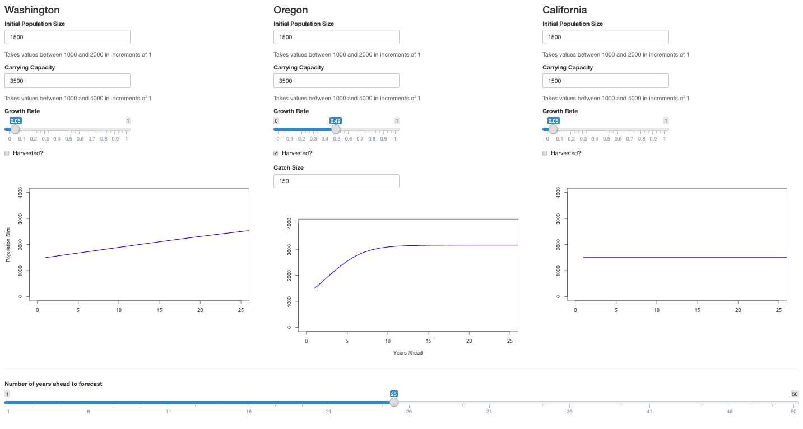

<!-- README.md is generated from README.Rmd. Please edit that file -->
RShiny
======

This repository contains materials for the RShiny section of FSH 507 - Super-Advanced R (Fall 2019)

Course syllabus available [here](https://docs.google.com/document/d/1S63IHjNBk8e7St6XcyqhVu98qpuRTUx3DHYqzWKYDys/edit?usp=sharing)

The lecture for today is one big shiny app. You can find it and run it locally on your own machine in the folder "lecture". It is also online [here](https://aebratt.shinyapps.io/shiny-lecture/). I didn't buy very many active hours though, so don't all go there! I will lecture off of this website so that everyone can see it, but things will go smoother if you run the smaller example apps downloaded from GitHub. You can find those in the section folders here (e.g. "fundamentals" and "mapping").

We will work up to writing the app below and we can add a few extra bells and whistles, time permitting. The solutions are also here, under "ultimate-test". No peeking!

